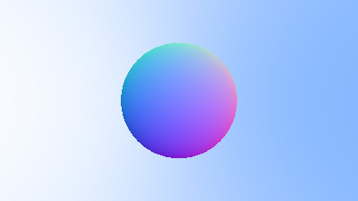

# Ray Tracing - Julia

This project is an exploration into ray tracing using the Julia programming language. I included the intermediary steps following the [_Ray Tracing in One Weekend_](https://raytracing.github.io/books/RayTracingInOneWeekend.html) guide in the `scripts` folder, along with some explanation for each of the files to document anything of interest. The final ray tracer resides `src` folder.

## Motivation

There are various reasons I've wanted to do this.
For a while I have been interested in Julia and I thought this project would be a nice way to learn the language.
Additionally I thought this would be a nice way to solidify certain concepts in linear algebra and geometry.
And finally there is the obvious aspect of gaining some nice insights into the basics of ray tracing and computer graphics.

## Progression

### Basic sphere

Generated with `julia scripts/basic_sphere.jl`

### Surface normals

Generated with `julia scripts/basic_normals`

### Surface normals with AA

### Lambertian

## References

- [_Ray Tracing in One Weekend_](https://raytracing.github.io/books/RayTracingInOneWeekend.html)
- [_Linear Algebra and its Applications_](https://www.pearson.com/en-us/subject-catalog/p/linear-algebra-and-its-applications/P200000006235)
- [_Julia Documentation_](https://docs.julialang.org/en/v1/)
- [_Computer Graphics from Scratch_](https://gabrielgambetta.com/computer-graphics-from-scratch/)
